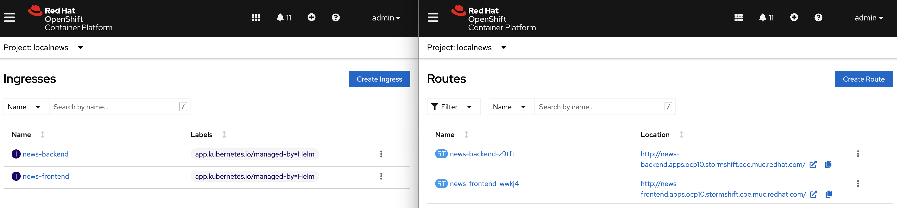

# Adapting the Dockerfiles & Helm

### News-Frontend component: Angular with NGINX&#x20;

In the [Helm Chart](https://github.com/sa-mw-dach/local-news-shift/tree/openshift/k8s/helm-chart) we see that the Image quay.io/k8snativedev/news-frontend:latest causes the trouble. For ease of use we included a Dockerfile with a multi-stage build process, to make it easier to follow along. In a later part, when we'll show how to move from upstream Tekton and ArgoCD to OpenShift, those two stages will be done in two distinct steps.&#x20;

But in the multi-stage Dockerfile below Stage 1 serves to build the application with _ng_ and makes the resulting artifact available to the next stage.&#x20;

If we look at Stage 2 of the Dockerfile we see that the Image runs a standard nginx from docker.io, exposes port 80 - the standard for nginx - and finally starts nginx. In the CMD instruction of the Dockerfile in line 14 we can see that a _settings.template.json_ file replaces the standard "settings.json". This allows for setting environment variables at each startup of the container, which is something Angular, unfortunately, does not provide out-of-the-box. There is also some code in the application to actually inject the variables passed in by the _settings.json_ file.

```
# Stage 1: build the app
FROM registry.access.redhat.com/ubi7/nodejs-14 AS builder
WORKDIR /opt/app-root/src
COPY package.json /opt/app-root/src
RUN npm install
COPY . /opt/app-root/src
RUN ng build --configuration production

# Stage 2: serve it with nginx
FROM nginx AS deploy
LABEL maintainer="Max Dargatz"
COPY --from=builder /opt/app-root/src/dist/news-frontend /usr/share/nginx/html
EXPOSE 80
CMD ["/bin/sh",  "-c",  "envsubst < /usr/share/nginx/html/assets/settings.template.json > /usr/share/nginx/html/assets/settings.json && exec nginx -g 'daemon off;'"]

```

While Stage 1, the build stage, already works with a Red Hat Universal Base Image (UBI) that per default runs with a non-root user, Stage 2, the serving stage, has a few security issues that made it crash with the OpenShift default settings as we saw earlier. Basically there are three issues:

1.  **Root User**

    Nginx from DockerHub runs per default with a root user - the default OpenShift [SCC](https://docs.openshift.com/container-platform/4.10/authentication/managing-security-context-constraints.html) (Security Context Constraint) prevents Containers from running with root privileges.
2. **Priviledged Ports**\
   [Priviledged ports](https://cloud.redhat.com/blog/linux-capabilities-in-openshift), in the range of 80 - 1024, are only available to the root user.  But the root user is not available.
3. **Specifically grant access to directories**\
   ****Below we see the logs of the news-frontend container, that is stuck in a _CrashLoopBackOff_ state.&#x20;

> /bin/sh: 1: cannot create /usr/share/nginx/html/assets/settings.json: Permission denied

This behaviour needs some more explanation because it is not just that OpenShift doesn't allow to start Containers with root permission. In OpenShift each Namespace/Project has a pool of user IDs to draw from. It is part of an annotation each OpenShift Project has and looks something like _openshift.io/sa.scc.uid-range=1000570000/10000_.&#x20;

So the Container starts with one of these UID's, overriding whatever UID the image itself may specify. The problem here is that this "arbitrary" user will not have access to _/usr/share/nginx/html/assets/._ But as you can see in our CMD instruction we substitute the values of some environment variables.

Now this is exactly the reason why two of our components failed to start. They want to start as root, but get assigned a different UID and, hence, are not able to run, because root was expected.

Now what are options to make our Container more secure and run on a fully supported and vetted stack?

1. **Run NGINX unpriviledged**
2. **Rewrite the nginx.conf to Listen on an unpriviledged port**
3. **Grant our "arbitrary" user access to the **_**assets**_** folder**

### Solving issue 1 & 2

While it seems like we need a customized nginx base image and have to bother with the config files - actually, we don't. We will just use the Universal Base Image (UBI) from Red Hat that runs an unpriviledged nginx listening on port 8080. This is a certified and, running on OpenShift, fully supported base image you can find [here](https://catalog.redhat.com/software/containers/ubi8/nginx-120/6156abfac739c0a4123a86fd?container-tabs=overview). So we change the base image for Stage 2 to the one depicted below.

```
# Stage 2: serve it with nginx
FROM registry.access.redhat.com/ubi8/nginx-120 AS deploy
```

### Solving issue 3

If you review the [Dockerfile of the UBI](https://catalog.redhat.com/software/containers/ubi8/nginx-120/6156abfac739c0a4123a86fd?container-tabs=dockerfile) we use as the base image you see that it uses User 1001. So it is tempting to give the permissions to _/opt/app-root/src/assets_ to User 1001. But, remember, even though 1001 is not the root user, OpenShift is overwriting this UID. Therefore, we have to take a different approach.

The OpenShift documentation provides a solution:

> For an image to support running as an arbitrary user, directories and files that are written to by processes in the image must be owned by the root group and be read/writable by that group. Files to be executed must also have group execute permissions.

Adding the following to our Dockerfile sets the directory and file permissions to allow users in the root group to access them in the built image:

```
RUN chgrp -R 0 /opt/app-root/src/assets && \
    chmod -R g=u /opt/app-root/src/assets
```

Because the container user is always a member of the root group, the container user can read and write these files. The root group does not have any special permissions (unlike the root user) so there are no security concerns with this arrangement.

After incorporating the three changes we end up with the following Dockerfile, building on the secure and supported foundation of the UBI.

```
# Stage 1: build the app
FROM registry.access.redhat.com/ubi8/nodejs-14 AS builder
WORKDIR /opt/app-root/src
COPY package.json /opt/app-root/src
RUN npm install
COPY . /opt/app-root/src
RUN ng build --configuration production

# Stage 2: serve it with nginx
FROM registry.access.redhat.com/ubi8/nginx-120 AS deploy
WORKDIR /opt/app-root/src
LABEL maintainer="Max Dargatz"
COPY --from=builder /opt/app-root/src/dist/news-frontend .

## customize for file permissions for rootless
RUN chgrp -R 0 /opt/app-root/src/assets && \
    chmod -R g=u /opt/app-root/src/assets

USER 1001
EXPOSE 8080
CMD ["/bin/sh",  "-c",  "envsubst < /opt/app-root/src/assets/settings.template.json > /opt/app-root/src/assets/settings.json && exec nginx -g 'daemon off;'"]

```


### Location Extractor: Python

For the Location Extractor component, that serves to extract locations and get coordinates for them, we will not go into same depth. But we have to fix it. In our original approach the Python App was started with an Image from Docker Hub ([Official Python Image](https://hub.docker.com/\_/python))with supervisord running nginx and a wsgi server. The issues are actually pretty similar to those described in previous part.

One possible solution is again to do a multi-stage build. Now you might say - wait a minute - Python is an interpreted language. Why is it necessary? It actually isn't a requirement but still seems reasonable to separate the installation of the dependencies and of a machine learning model from the Open Source library spaCy (see line 7) from Stage 2, where the application is started with the WSGI server Gunicorn. And again, in both stages, we build on a fully supported UBI with Python 3.9 installed.

```
# Stage 1: package the app and dependencies in a venv
FROM registry.access.redhat.com/ubi8/python-39 as build
WORKDIR /opt/app-root/src
RUN python -m venv /opt/app-root/src/venv
ENV PATH="/opt/app-root/src/venv/bin:$PATH"
COPY requirements.txt .
RUN pip3 install -r requirements.txt && python3 -m spacy download en_core_web_md

# Stage 2: start the application with gunicorn
FROM registry.access.redhat.com/ubi8/python-39
WORKDIR /opt/app-root/src
COPY --from=build /opt/app-root/src/venv ./venv
COPY ./src /opt/app-root/src/src
ENV PATH="/opt/app-root/src/venv/bin:$PATH"
USER 1001
CMD ["gunicorn", "--bind", "0.0.0.0:5000", "src.wsgi:app" ]
```

### The other components: Quarkus & Java

The other components were already working without any adjustments. Still, if we have a look at the Git Repo and the Dockerfiles for the news-backend component, a Quarkus application, and the feed-scraper component, a Java EE application, we discover that we can also leverage the UBI here e.g. by using [openjdk-11](https://catalog.redhat.com/software/containers/ubi8/openjdk-11/5dd6a4b45a13461646f677f4) or the [openjdk11-runtime](https://catalog.redhat.com/software/containers/ubi8/openjdk-11-runtime/606dcb7d0f75e8ece4deec1f).

If we apply all the changes above to our images and configure our Helm Chart accordingly, we run on a Red Hat certified stack with all our application components. The next thing to look into is what changes the concept of OpenShift Routes compared to the Kubernetes Ingress resource mean for us.

## Configuring the Helm Chart

In the [Git Repo](https://github.com/sa-mw-dach/local-news-shift/tree/openshift/k8s/helm-chart) we provide a new _values_ File to reflect the necessary changes we have made to the Container Images of the news-frontend and the location-extractor component. We rebuilt the Images and tagged them with _openshift_ and reflected the changes in _values-openshift.yaml_.&#x20;

The nice thing about OpenShift Routes is that they get created automatically if we provide an Ingress Resource. There are two components we have to expose to the public. One is the news-frontend and the other one the news-backend, because the Angular Web Application is making a connection from the client-side to the news-backend. Both Ingresses are prepared as Helm templates already. The only thing we have to do is to provide our specific cluster ingress subdomain when deploying the application and specify our new _values-openshift.yaml_ instead of the stand _values.yaml_ file.

```
helm upgrade -i localnews k8s/helm-chart -f k8s/helm-chart/values-openshift.yaml \
--set newsfrontend.backendConnection="viaIngress" \
--set newsfrontend.envVars.backend.prefix.value="http://" \
--set newsfrontend.envVars.backend.nodePort.value="80" \
--set localnews.domain="mycluster.eu-de.containers.appdomain.cloud"
```

What we observe is that even though we provided only an Ingress resource, OpenShift automatically creates a route for us, that is then publicly accessible.



## Leverage OpenShift

We have seen that with the Red Hat certified Container Catalog, containing the different flavours of the UBI, and OpenShift as a platform we can easily roll-out our application with Helm in a secure and supported way with base images from a vetted source. We can now manage our Helm release via OpenShift and configure our Application with the Developer view.

.png>)

