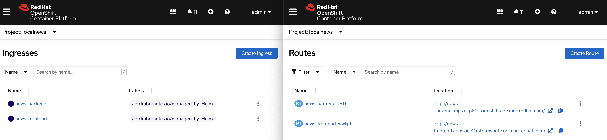

# OpenShift GitOps

## Installation

Again Let us start with the basics. How do you install ArgoCD into your cluster? Also ArgoCD comes with a community Operator or you can install it via Helm. But just as Tekton in OpenShift you do it via the integrated OperatorHub which can be accessed via the UI or a simple YAML file. This installs you the fully supported OpenShift GitOps Operator. While the Pipelines UI integrated into OpenShift is already pretty powerful, the first significant steps towards this for GitOps have been made with OpenShift v4.10.

```
oc apply -f snippets/chapter5/openshift/operators-subs/pipelines-operator-sub.yaml
```

If you are unfamiliar with GitOps check out this article and the picture below showing the concept:



## Tekton Tasks

Yes, before we jump right into GitOps, let's quickly think about how to integrate this with Pipelines. Because at the end of the day, we would like to use GitOps together with an automated Pipeline.

.png>)

## Tekton Tasks

Therefore, we have to start with our Tekton Tasks again. Do we have them all ready in the cluster? Almost! As before, we pull the repo, build the Java Quarkus application with maven and build & push a container image.

In this example we use a Helm Chart to deploy the application. But a "helm install / helm upgrade" Task is no longer required. Rather we have to put a reference to our new Container Image into the Helm Chart, here by replacing the Image Tag with an updated value. We use yq, the YAML pendant to jq, to do the change. But there is no lightweight container image with yq available in the cluster.&#x20;

We could now build a container image with the Red Hat UBI as base image and install yq, but for this demo we will use a Task from the community Tekton catalog.

```
kubectl apply -n localnews-pipelines -f https://raw.githubusercontent.com/tektoncd/catalog/main/task/yq/0.2/yq.yaml
```

The "git cli" and "oc cli" Tasks are used to push the updated Helm Chart to our Git Repo and, afterwards, run a check for the changes to become applied to the cluster. Of course, we expect ArgoCD to catch the changes and do this by itself, but better safe than sorry :) (What if ArgoCD is down by chance?)

Both Tasks are available as OpenShift Cluster Tasks, so we can just change from the community Tasks to the OpenShift certified cluster Tasks and apply our updated pipeline.

```
oc apply -n localnews-pipelines -f snippets/chapter5/openshift/pipeline-resources/java-backend-simple-pipeline-gitops.yaml
```

Since ArgoCD is installed via the supported OpenShift GitOps functionality nothing stops us now from creating our ArgoCD application, which will in fact monitor the Helm Chart and install it in our cluster.

```
kubectl apply -n openshift-gitops -f snippets/chapter5/openshift/gitops/argocd-application.yaml
```

But did it work? You could head over to the Dashboard now, which will tell you OutOfSync and you will see some permission errors. Guess what - Security Measures enforced by OpenShift! OpenShift GitOps needs explicit permissions to manage the Namespace "newsbackend-integration-gitops" which is used to deploy the application.

.png>)

So, since OpenShift GitOps explicitly needs to be given access to a namespace that it is supposed to manage, just add a label to the respective namespace:

```
oc label namespace newsbackend-integration-gitops argocd.argoproj.io/managed-by=openshift-gitops
```

After the next poll OpenShift GitOps will notice that the service account associated with this operations now has sufficient permissions and will deploy the application via Helm.

Check it via the GUI or CLI with

```
kubectl describe application -n openshift-gitops localnews
```

